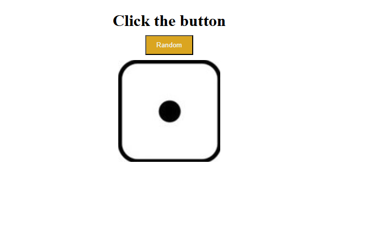

# Ludo Dice Game

This project is a simple dice game inspired by Ludo, created using HTML, CSS, and JavaScript. Clicking the button rolls the dice and displays a new number each time.

## Project Overview

The Ludo Dice Game generates a random dice number (from 1 to 6) whenever the button is clicked. This project serves as an interactive practice in front-end development, combining HTML, CSS, and JavaScript.

## Technologies Used

- HTML5
- CSS3
- JavaScript

## Features

- **Interactive Dice Roll**: Clicking the button rolls the dice and changes the number displayed.
- **Randomized Dice Numbers**: JavaScript is used to generate random numbers between 1 and 6.

